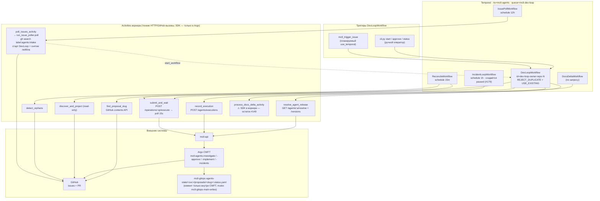
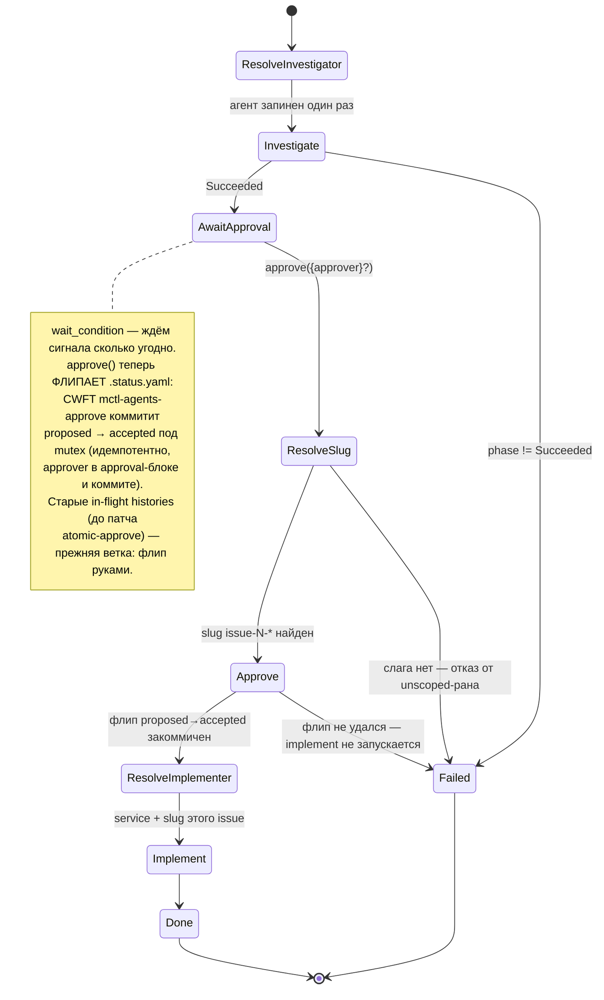
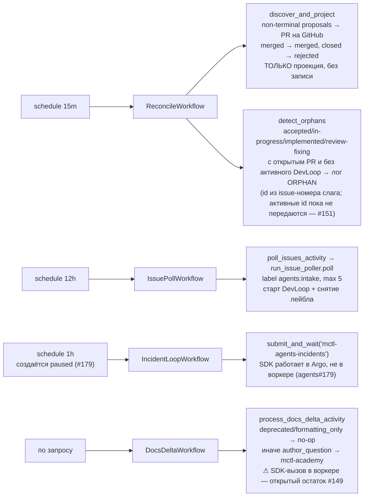

# mctl-agents — Temporal flow (по коду `orchestrator/temporal/`)

Источник: `orchestrator/temporal/`. Диаграммы встроены ниже — GitHub рендерит
mermaid сам. Те же схемы отдельными файлами лежат в `docs/diagrams/*.mmd`, для
редактирования и для рендера вне GitHub:
`npx @mermaid-js/mermaid-cli -i <f>.mmd -o <f>.png -b white -s 4`.
PNG намеренно не коммитятся — 2 МБ бинарников ради того, что и так отрисуется.

Сверено с кодом 2026-08-29 (atomic approve — PR #212; phase 6 — ADR-006).


## 1. Общая карта: триггеры → Temporal → Argo → GitHub/gitops



[исходник](diagrams/temporal-flow-overview.mmd)

## 2. DevLoopWorkflow — последовательность одного issue

```mermaid
sequenceDiagram
    autonumber
    participant OP as Оператор / поллер
    participant T as Temporal DevLoopWorkflow
    participant R as resolve_agent_release
    participant S as submit_and_wait
    participant A as mctl-api → Argo CWFT
    participant E as record_execution

    OP->>T: start(IssueRef) id=dev-loop-{owner}-{repo}-{N}
    T->>R: resolve("issue-investigator", production)
    R-->>T: ResolvedRelease | None (None → дефолтный образ CWFT)
    T->>S: submit_and_wait("mctl-agents-investigate", {issue_url, agent_image?, agent_version?})
    S->>A: POST /operations/.../execute
    A-->>S: workflowName
    Note over S,A: heartbeat(workflowName) ДО первого poll:<br/>ретрай возобновит polling,<br/>а не пересабмитит
    loop каждые 15s (до 2ч, heartbeat 2м)
        S->>A: GET /workflows/{name}
        A-->>S: phase
    end
    S-->>T: WorkflowResult(phase)
    T->>E: record_execution(agent, version, image_ref, target_repo, argo_workflow, phase)
    Note over T,E: best-effort — ActivityError гасится, воркфлоу не падает

    alt investigate не Succeeded
        T-->>OP: DevLoopResult(implement=None)
    else Succeeded
        Note over T,R: await workflow.wait_condition(approved) —<br/>durable-ожидание, может длиться днями
        OP->>T: signal approve({approver}?)
        T->>T: find_proposal_slug(repo, N) → slug issue-N-*<br/>(нет слага → non-retryable fail)
        T->>S: submit_and_wait("mctl-agents-approve", {service, slug, approver})
        Note over S,A: атомарный флип proposed→accepted<br/>в gitops под mutex; идемпотентен<br/>(уже accepted → no-op). Fail → стоп до implement
        T->>R: resolve("implementer", production)
        Note over T,R: resolve ПОСЛЕ флипа: сбой registry<br/>не должен испарить одобрение (codex P1, PR #212)
        T->>S: submit_and_wait("mctl-agents-implement", {service, slug, ...})
        S->>A: POST /operations/.../execute → poll
        S-->>T: WorkflowResult
        T->>E: record_execution("implementer", ...)
        T-->>OP: DevLoopResult(investigate, approve, implement)
    end
```

[исходник](diagrams/temporal-flow-devloop-sequence.mmd)

## 3. Состояния DevLoopWorkflow



[исходник](diagrams/temporal-flow-states.mmd)

## 4. Расписания и что они делают



[исходник](diagrams/temporal-flow-schedules.mmd)

## Границы (важно для чтения схемы)

- Temporal владеет **investigate → approve (атомарный флип через CWFT `mctl-agents-approve`) → implement**. Tier 3 (shepherd, ревью/мердж) в Temporal **не перенесён** — по-прежнему `run_shepherd.py` по крону; Reconcile лишь читает его состояние. Перенос shepherd'а и стадии merge/deploy/monitor — phase 6: ADR-006, трекер agents#217.
- Коммиты в gitops `main` делает **только Argo CWFT** (держит мьютекс `mctl-gitops-main-writes`); `record_execution` — это отдельный аудит-трейл в mctl-api, не `.status.yaml`.
- Ретраи: `submit_and_wait` — `maximum_attempts=3`, но повторная попытка **возобновляет polling** по heartbeat, а не пересабмичивает (CWFT уже сам ретраит на втором OAuth-аккаунте). Сентинел «submitted, name unparseable» падает громко, чтобы не задвоить SDK-ран.
- **IncidentLoopWorkflow не запускает responder сам** — он сабмитит Argo-операцию
  `mctl-agents-incidents`, как DevLoop сабмитит investigate/implement. Раньше он
  вызывал `respond_incidents_activity` и гонял Claude SDK внутри воркера; там нет
  ни чекаута gitops, ни STATE_DIR, ни шага коммита, поэтому каждый тик умирал
  OOMKilled на лимите 256Mi. Скрывалось это лишь до тех пор, пока у SDK не было
  OAuth-токена (agents#179, gitops#850).
- Responder разбирает инциденты в статусах `escalated` (mctl-agent закончил и
  чинить не будет — причина в `analysis`) и `analyzing` (либо в полёте, либо
  брошен при рестарте). Разделяет их `MIN_AGE_MINUTES`. Шелла у responder'а нет:
  он читает summary инцидентов и логи сервисов, то есть текст, который выбирает
  атакующий (agents#182, остаток — agents#183).
- Argo-объект живёт недолго: `secondsAfterCompletion: 3600`, а успешный — всего
  `secondsAfterSuccess: 1800`. Результат нужно сохранять сразу, перечитать позже
  нельзя. Упавшие держатся дольше (`secondsAfterFailure: 259200`), специально —
  чтобы инцидент можно было разобрать на следующий день.
