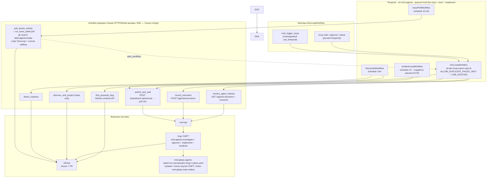
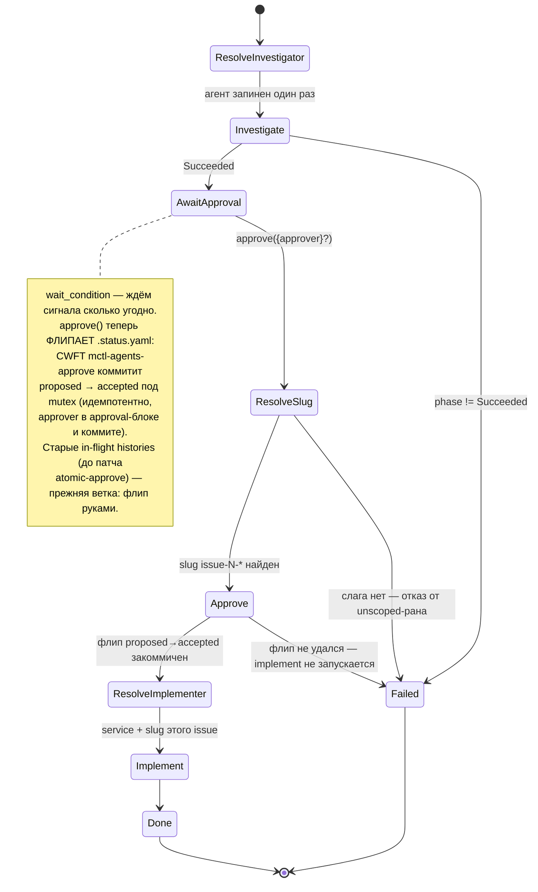
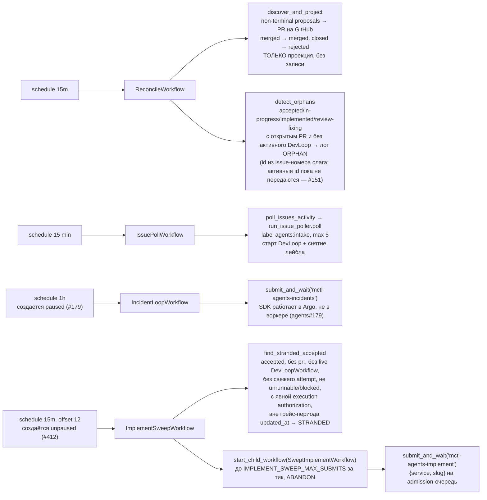

# mctl-agents — Temporal flow (по коду `orchestrator/temporal/`)

Источник: `orchestrator/temporal/`. Диаграммы встроены ниже — GitHub рендерит
mermaid сам. Те же схемы отдельными файлами лежат в `docs/diagrams/*.mmd`, для
редактирования и для рендера вне GitHub:
`npx @mermaid-js/mermaid-cli -i <f>.mmd -o <f>.png -b white -s 4`.
PNG намеренно не коммитятся — 2 МБ бинарников ради того, что и так отрисуется.

Сверено с кодом 2026-08-29 (atomic approve — PR #212; phase 6 — ADR-006).


## 1. Общая карта: триггеры → Temporal → Argo → GitHub/gitops



[исходник](diagrams/temporal-flow-overview.mmd)

## 2. DevLoopWorkflow — последовательность одного issue

```mermaid
sequenceDiagram
    autonumber
    participant OP as Оператор / поллер
    participant T as Temporal DevLoopWorkflow
    participant R as resolve_agent_release
    participant S as submit_and_wait
    participant A as mctl-api → Argo CWFT
    participant E as record_execution

    OP->>T: start(IssueRef) id=dev-loop-{owner}-{repo}-{N}
    T->>R: resolve("issue-investigator", production)
    R-->>T: ResolvedRelease (None → воркфлоу падает, A4 #241)
    T->>S: submit_and_wait("mctl-agents-investigate", {issue_url, agent_image?, agent_version?})
    S->>A: POST /operations/.../execute
    A-->>S: workflowName
    Note over S,A: heartbeat(workflowName) ДО первого poll:<br/>ретрай возобновит polling,<br/>а не пересабмитит
    loop каждые 15s (до 2ч, heartbeat 2м)
        S->>A: GET /workflows/{name}
        A-->>S: phase
    end
    S-->>T: WorkflowResult(phase)
    T->>E: record_execution(agent, version, image_ref, target_repo, argo_workflow, phase)
    Note over T,E: best-effort — ActivityError гасится, воркфлоу не падает

    alt investigate не Succeeded
        T-->>OP: DevLoopResult(implement=None)
    else Succeeded
        Note over T,R: await workflow.wait_condition(approved) —<br/>durable-ожидание, может длиться днями
        OP->>T: signal approve({approver}?)
        T->>T: find_proposal_slug(repo, N) → slug issue-N-*<br/>(нет слага → non-retryable fail)
        T->>S: submit_and_wait("mctl-agents-approve", {service, slug, approver})
        Note over S,A: атомарный флип proposed→accepted<br/>в gitops под mutex; идемпотентен<br/>(уже accepted → no-op). Fail → стоп до implement
        T->>R: resolve("implementer", production)
        Note over T,R: resolve ПОСЛЕ флипа: сбой registry<br/>не должен испарить одобрение (codex P1, PR #212)
        T->>S: submit_and_wait("mctl-agents-implement", {service, slug, ...})
        S->>A: POST /operations/.../execute → poll
        S-->>T: WorkflowResult
        T->>E: record_execution("implementer", ...)
        T-->>OP: DevLoopResult(investigate, approve, implement)
    end
```

[исходник](diagrams/temporal-flow-devloop-sequence.mmd)

## 3. Состояния DevLoopWorkflow



[исходник](diagrams/temporal-flow-states.mmd)

## 4. Расписания и что они делают



[исходник](diagrams/temporal-flow-schedules.mmd)

## Границы (важно для чтения схемы)

- Temporal владеет **investigate → approve (атомарный флип через CWFT `mctl-agents-approve`) → implement**. Tier 3 (shepherd, ревью/мердж) в Temporal **не перенесён** — по-прежнему `run_shepherd.py` по крону; Reconcile лишь читает его состояние. Перенос shepherd'а и стадии merge/deploy/monitor — phase 6: ADR-006, трекер agents#217.
- Коммиты в gitops `main` делает **только Argo CWFT** (держит мьютекс `mctl-gitops-main-writes`); `record_execution` — это отдельный аудит-трейл в mctl-api, не `.status.yaml`.
- Ретраи: `submit_and_wait` — `maximum_attempts=3`, но повторная попытка **возобновляет polling** по heartbeat, а не пересабмичивает (CWFT уже сам ретраит на втором OAuth-аккаунте). Сентинел «submitted, name unparseable» падает громко, чтобы не задвоить SDK-ран.
- **IncidentLoopWorkflow не запускает responder сам** — он сабмитит Argo-операцию
  `mctl-agents-incidents`, как DevLoop сабмитит investigate/implement. Раньше он
  вызывал `respond_incidents_activity` и гонял Claude SDK внутри воркера; там нет
  ни чекаута gitops, ни STATE_DIR, ни шага коммита, поэтому каждый тик умирал
  OOMKilled на лимите 256Mi. Скрывалось это лишь до тех пор, пока у SDK не было
  OAuth-токена (agents#179, gitops#850).
- Responder разбирает инциденты в статусах `escalated` (mctl-agent закончил и
  чинить не будет — причина в `analysis`) и `analyzing` (либо в полёте, либо
  брошен при рестарте). Разделяет их `MIN_AGE_MINUTES`. Шелла у responder'а нет:
  он читает summary инцидентов и логи сервисов, то есть текст, который выбирает
  атакующий (agents#182, остаток — agents#183).
- Argo-объект живёт недолго: `secondsAfterCompletion: 3600`, а успешный — всего
  `secondsAfterSuccess: 1800`. Результат нужно сохранять сразу, перечитать позже
  нельзя. Упавшие держатся дольше (`secondsAfterFailure: 259200`), специально —
  чтобы инцидент можно было разобрать на следующий день.
- **ImplementSweepWorkflow (agents#412)** — единственный путь, которым `accepted`
  становится actionable queue заново вне живого DevLoopWorkflow: флип
  `mctl_trigger_approve` и запись `status: accepted` инцидент-респондером сами по
  себе ничего не запускают. Тик fail-closed относительно visibility-запроса
  (неизвестный active set → сабмитится ничего) и дедуплицируется id
  ребёнка (`implement-sweep-{service}-{slug}`, `ALLOW_DUPLICATE` +
  `WorkflowAlreadyStartedError` пойман как no-op) — без блокировки. Каждый
  кандидат логируется строкой `STRANDED service=... slug=... reason=...`
  независимо от того, был он сабмичен, отброшен грейс-периодом/лизой/cap'ом,
  исчерпанным pre-start-бюджетом или нечитаемым бюджетом. Бюджет считается
  одним bulk-запросом `WorkflowId IN (...)` на тик, нарезанным по 100 id;
  workflow id вне `[A-Za-z0-9._-]` запроса не получает и **опускается** из
  ответа, а не возвращается нулём — пропущенный ключ означает «бюджет
  неизвестен», и такой кандидат не сабмитится (`unknown_budget` в результате),
  тогда как падение самого запроса пропускает тик целиком.
  `cronworkflow-mctl-agents-implement` (Argo, `*/5`) остаётся suspended —
  замена, а не временная приостановка.
- **Свип fail-closed по авторизации исполнения (продуктовое решение 19.09.2026
  по agents#412).** Свип сабмитит исполнение по записям, за которыми никто не
  следит, поэтому он требует явной авторизации:
  `proposal_state.execution_authorization` — сегодня это только проверенное
  человеческое одобрение (`approval.approved_by`, не анонимное). Отсутствие
  `control` / `approval` здесь **никогда** не читается как «одобрение не
  требуется», хотя на стороне записи `human_approval_satisfied` именно так и
  трактует отсутствующий `control` блок: это два разных вопроса. Провенанс
  автора записи (`updated_by`) авторизацией не является — allowlist писателей
  был отвергнут явно, и само поле из `ProposalStateRef` убрано, чтобы его
  нельзя было собрать заново. 69 legacy-записей `incident-*`, лежащих в
  `accepted` с августа, — ровно эта форма: они карантинируются от исполнения,
  их requirements/design/tasks сохраняются нетронутыми, а сами они попадают в
  `ImplementSweepResult.unauthorized` для человеческого разбора.
  Второй путь авторизации — отдельно определяемая явная autonomy policy —
  пока не определён (`AUTHORIZATION_AUTONOMY_POLICY` зарезервирован под неё).
  Карантин различает две формы с противоположными средствами исправления:
  `legacy auto-accepted / unreviewed` (одобрения не было вовсе) и
  `approved with no recorded approver identity` — человек одобрил, но путь
  одобрения не записал личность (`dev_loop` шлёт `"approver": ... or
  "unknown"`, и approve-сигнал без payload даёт то же самое). Исполнять нельзя
  в обоих случаях, но во втором чинится переодобрением, а не триажом.
- **Бюджет pre-start попыток.** `MAX_SWEEP_PRESTART_ATTEMPTS` ограничивает
  повторные сабмиты по одному и тому же child id, и считается **только** по
  исходу `pre_start` — единственному, который не двигает ни одного поля
  `.status.yaml`, поэтому ничто другое не убирает предложение из набора
  кандидатов следующего тика. Visibility не умеет фильтровать по
  `ApplicationError.type`, поэтому `count_swept_prestart_failures` дочитывает
  собственную терминальную ошибку каждого упавшего исполнения и считает только
  `PRE_START_ERROR_TYPE`; исход, который прочитать не удалось (в том числе
  выдохшийся против аварии Argo/mctl-api `submit_and_wait`), не засчитывается.
  Запрос — один на тик, `WorkflowId IN (...)` по всему набору кандидатов: по
  одному запросу на кандидата давало фан-аут размером с бэклог (71), а лимит
  на число запросов вместо этого навсегда голодал хвост списка, потому что
  список пересобирается в стабильном порядке, а кандидат сверх бюджета из него
  не уходит. Исчерпание бюджета видно в `ImplementSweepResult.over_budget`, а
  не только в логе, и это единственный его отчёт: строку `record_execution` на
  каждого сверхбюджетного кандидата каждый тик писать нельзя — это 96
  строк/сутки/предложение с `agent="implementer"`, `phase="Failed"` и
  temporal-id ребёнка в `argo_workflow_name`, неотличимых от настоящего падения
  имплементера и не называющих никакого Argo-воркфлоу. Известное
  ограничение, названное прямо: бюджет живёт в Temporal visibility, которая
  сбрасывается вместе с retention-окном, — durable-маркер требует записи в
  `.status.yaml`, пути к которой у Temporal-воркера сегодня нет (все записи
  `needs-triage` живут в `run_shepherd`, на стороне CWFT).
